# Buscador de Vagas de Tecnologia no Brasil

Aplicação *local-first* em Python que transforma um currículo em um perfil profissional auditável, busca vagas de tecnologia no Brasil e recomenda oportunidades com regras determinísticas. O fluxo principal é automático e orientado pelo currículo; não depende de LLM e não realiza candidaturas.

## Começando rápido

Requer Python 3.12 ou superior. O projeto é testado no CI com Python 3.12 e 3.14.

1. Clone o repositório, crie um ambiente virtual e instale as dependências:

   ```bash
   git clone https://github.com/Caslu-rj/buscador-de-vaga.git
   cd buscador-de-vaga
   python -m venv .venv
   ```

   Linux/macOS:

   ```bash
   source .venv/bin/activate
   pip install -e ".[dev]"
   ```

   Windows PowerShell:

   ```powershell
   .venv\Scripts\Activate.ps1
   pip install -e ".[dev]"
   ```

2. Importe um currículo PDF ou DOCX e gere um `CandidateProfile` local:

   ```bash
   buscar-vagas importar-curriculo --file meu-curriculo.pdf --output meu-perfil.json
   ```

3. [Configure as credenciais](#credenciais-das-fontes-live) de pelo menos uma fonte live.

4. Execute a busca automática recomendada:

   ```bash
   buscar-vagas --profile meu-perfil.json --location "Rio de Janeiro" --jooble --adzuna
   ```

   É possível usar apenas `--jooble` ou apenas `--adzuna`. No fluxo automático, `--category` e `--career-preference` não são obrigatórios.

5. Leia a `Shortlist` e a seção **Candidaturas recomendadas** da saída. `Pronta` indica uma oportunidade elegível e alinhada; `Revisar` pede avaliação humana antes de considerar a candidatura.

## O que existe no MVP

- importação local de currículos PDF e DOCX;
- parsing determinístico em `CandidateProfileDraft`, com `Evidence` e `Provenance`, revisão humana opcional e consolidação em `CandidateProfile`;
- posicionamento profissional pela política `candidate-positioning-v1`, com inferência conservadora de categorias e níveis;
- busca automática orientada pelo perfil e busca manual por categoria;
- integrações live com Jooble Brasil e Adzuna Brasil, isoladas pelo seam `JobSource`;
- execução combinada com `MultiSourceJobSource`;
- normalização de vagas e de localizações brasileiras, seguida de deduplicação conservadora;
- matching explicável pela política `match-v2`, com `FitScore`, `EligibilityStatus` e `Shortlist`;
- preferência opcional de início de carreira pela política `career-entry-v1`;
- `CandidateCareerAlignment` e recomendações `ApplicationCandidate` pela política `application-candidate-v1`;
- CLI, testes offline com `pytest`, Ruff, mypy em modo estrito e GitHub Actions CI.

## Fluxo do produto

```mermaid
flowchart LR
    Resume[Currículo PDF ou DOCX] --> Reader[ResumeReader]
    Reader --> Parser[ResumeParser determinístico]
    Parser --> Profile[CandidateProfile<br/>Evidence e Provenance]
    Profile --> Positioning[Candidate Positioning]
    Positioning --> Strategy[AutomaticCareerSearchStrategy]
    Strategy --> Queries[Consultas profissionais]
    Queries --> Multi[MultiSourceJobSource]
    Multi --> Jooble[Jooble Brasil]
    Multi --> Adzuna[Adzuna Brasil]
    Jooble --> Normalize[Normalização]
    Adzuna --> Normalize
    Normalize --> Dedupe[Deduplicação]
    Dedupe --> Match[MatchAssessment]
    Match --> Decision[FitScore + EligibilityStatus]
    Decision --> Alignment[CandidateCareerAlignment]
    Alignment --> Shortlist[Shortlist]
    Shortlist --> Candidate[ApplicationCandidate]
    Candidate --> CLI[CLI]
```



O currículo é lido por `ResumeReader`; `ResumeParser` extrai fatos por regras e registra a origem de cada `Evidence` em `Provenance`. O perfil consolidado passa pelo posicionamento profissional, que alimenta a estratégia automática. As fontes devolvem `JobPosting`; a descoberta os normaliza e consolida em `Opportunity` antes de avaliar compatibilidade, elegibilidade e alinhamento.

No modo manual, `--category` seleciona uma categoria do perfil e `CareerSearchStrategy` gera a consulta correspondente. `SyntheticJobSource`, usado com `--postings-file`, existe para testes e demonstrações offline; não é uma fonte live principal.

## Credenciais das fontes live

Use `.env.example` apenas como referência dos nomes das variáveis. O programa lê as credenciais do ambiente e não carrega arquivos `.env` automaticamente. Nunca coloque valores reais em `.env.example`, nem versione arquivos ou comandos contendo segredos.

Windows PowerShell:

```powershell
$env:JOOBLE_API_KEY="..."
$env:ADZUNA_APP_ID="..."
$env:ADZUNA_APP_KEY="..."
```

Linux/macOS:

```bash
export JOOBLE_API_KEY="..."
export ADZUNA_APP_ID="..."
export ADZUNA_APP_KEY="..."
```

Para `--jooble`, configure `JOOBLE_API_KEY`. Para `--adzuna`, configure `ADZUNA_APP_ID` e `ADZUNA_APP_KEY`. A busca combinada exige as credenciais das duas fontes.

## Uso da CLI

Consulte todos os argumentos disponíveis com:

```bash
buscar-vagas --help
buscar-vagas importar-curriculo --help
```

### Importar e revisar um currículo

O comando aceita `.pdf` e `.docx`. A leitura e o parsing acontecem localmente.

Para inspecionar o rascunho e as evidências sem gravar um perfil:

```bash
buscar-vagas importar-curriculo --file meu-curriculo.pdf --review
```

Para consolidar o perfil em JSON:

```bash
buscar-vagas importar-curriculo --file meu-curriculo.pdf --output meu-perfil.json
```

Um arquivo existente não é sobrescrito por padrão. Autorize explicitamente a substituição com `--force`:

```bash
buscar-vagas importar-curriculo --file meu-curriculo.pdf --output meu-perfil.json --force
```

Também é possível combinar `--review` e `--output`. PDFs escaneados sem camada de texto não têm suporte a OCR no MVP.

### Busca automática, recomendada

Jooble Brasil:

```bash
buscar-vagas --profile meu-perfil.json --location "Rio de Janeiro" --jooble
```

Adzuna Brasil:

```bash
buscar-vagas --profile meu-perfil.json --location "Rio de Janeiro" --adzuna
```

Jooble e Adzuna na mesma execução:

```bash
buscar-vagas --profile meu-perfil.json --location "Rio de Janeiro" --jooble --adzuna
```

Use `--limit` para limitar a `Shortlist` final. `--career-preference entry-level` é opcional e acrescenta uma avaliação separada, `CareerPreferenceAssessment`, pela política `career-entry-v1`.

### Busca manual por categoria

Informe `--category` quando quiser controlar explicitamente a categoria. Ela precisa pertencer às `target_categories` do perfil.

```bash
buscar-vagas --profile meu-perfil.json --category software-development --location "Rio de Janeiro" --jooble
```

As categorias aceitas são `software-development`, `it-support-infrastructure`, `systems`, `quality-assurance` e `data`.

### Execução offline

Uma fixture sintética permite percorrer o modo manual sem chamar APIs live:

```bash
buscar-vagas --profile examples/candidate-profile.example.json --category software-development --location "Rio de Janeiro, RJ" --postings-file examples/job-postings.example.json
```

`--postings-file` não pode ser combinado com `--jooble` ou `--adzuna`.

## Análise automática do perfil

A política `candidate-positioning-v1` avalia o `CandidateProfile` de modo determinístico. Para cada categoria, ela registra um score e uma confiança e recomenda níveis profissionais compatíveis. Quando não há evidência explícita de senioridade, a inferência é conservadora; sinais conflitantes podem produzir nível desconhecido.

A política seleciona no máximo três categorias com suporte suficiente. `AutomaticCareerSearchStrategy` usa tabelas estáticas de termos profissionais para montar no máximo seis consultas por execução, sem transformar texto livre do currículo em query. Não são enviados como termos de busca:

- nome, e-mail, telefone ou endereço;
- texto bruto do currículo;
- `Evidence.statement`.

## FitScore e elegibilidade

A política `match-v2` calcula o `FitScore` de 0 a 100 em quatro dimensões versionadas:

| Dimensão | Peso |
| --- | ---: |
| `job-category` | 40 |
| `skills` | 25 |
| `entry-program-seniority` | 20 |
| `location-workplace-mode` | 15 |

O `FitScore` mede compatibilidade sustentada pelas evidências disponíveis. `EligibilityStatus` é uma decisão separada:

- `eligible`: nenhum impedimento foi identificado;
- `uncertain`: há dados insuficientes ou possíveis impedimentos;
- `ineligible`: um requisito impeditivo foi comprovadamente contradito.

`unknown` significa que não existe evidência suficiente para concluir; não significa `contradicts` e não cria uma lacuna falsa. Por isso, um `FitScore` alto sozinho não determina que uma candidatura deva ser feita.

Se informado, `--career-preference entry-level` afeta a recomendação e a ordenação por uma avaliação própria; não altera o `FitScore` nem o `EligibilityStatus`.

## Alinhamento de carreira

`CandidateCareerAlignment` compara os níveis estimados para o candidato com os sinais de nível da oportunidade:

- `MATCH`: níveis compatíveis;
- `REVIEW`: dados ausentes, ambíguos ou que exigem decisão humana;
- `ABOVE_PROFILE`: a oportunidade pede nível superior ao estimado para o candidato;
- `BELOW_PROFILE`: a oportunidade está abaixo do nível estimado para o candidato.

Essa camada orienta ranking e recomendação, mas não modifica `FitScore` nem `EligibilityStatus`.

## Candidaturas recomendadas

`ApplicationCandidate` é a seleção final da política `application-candidate-v1`. Uma oportunidade só entra nessa seleção quando tem `FitScore >= 80`, `EligibilityStatus.ELIGIBLE` e nenhum requisito impeditivo confirmado.

No fluxo automático:

| Alinhamento | Resultado |
| --- | --- |
| `MATCH` | `READY` (`Pronta`) |
| `REVIEW` | `REVIEW` (`Revisar`) |
| `BELOW_PROFILE` | `REVIEW` (`Revisar`) |
| `ABOVE_PROFILE` | não é recomendada |

No fluxo manual, uma oportunidade elegível sem alinhamento automático recebe `READY`.

Exemplo resumido de saída:

```text
Candidaturas recomendadas

1. Desenvolvedor Python
   FitScore: 90/100
   Status: Pronta

2. Estágio em Desenvolvimento
   FitScore: 85/100
   Status: Revisar
```

Uma `ApplicationCandidate` não realiza a candidatura: não abre navegador, não preenche formulário e não envia currículo. Ela apenas identifica oportunidades que merecem consideração humana.

## Fontes e consolidação

- `JoobleJobSource` consulta a primeira página da API do Jooble Brasil.
- `AdzunaJobSource` consulta a primeira página da API da Adzuna Brasil.
- `MultiSourceJobSource` executa todas as fontes configuradas e reúne seus resultados em uma busca.

A descoberta preserva a procedência de cada publicação, normaliza texto e localizações brasileiras e faz deduplicação conservadora por identidade externa, URL canônica ou equivalência inequívoca de empresa, título e localização.

## Privacidade e segurança

- O currículo, o `CandidateProfile`, as `Evidence` e suas `Provenance` são processados e mantidos localmente.
- Credenciais de APIs ficam em variáveis de ambiente e não aparecem nas mensagens seguras de erro.
- Em buscas live, as APIs externas recebem credenciais, localização, limite e consultas profissionais geradas pelas estratégias. Portanto, não é correto dizer que nenhum dado sai da máquina.
- As consultas automáticas são construídas por tabelas estáticas e não devem conter dados pessoais, texto bruto do currículo nem `Evidence.statement`.
- O core não requer LLM nem envia o currículo a um serviço de IA.
- Perfis e currículos reais não devem ser adicionados ao repositório.

## Limitações atuais

- A qualidade da descoberta depende dos campos e descrições retornados por Jooble e Adzuna.
- Cada adapter live consulta apenas a primeira página por query; quotas e disponibilidade pertencem aos fornecedores.
- Descrições incompletas ou ambíguas podem produzir requisitos `unknown`, elegibilidade `uncertain` ou alinhamento `REVIEW`.
- A extração de currículos é baseada em texto e regras; PDFs escaneados sem camada de texto e OCR não são suportados.
- Matching, posicionamento e deduplicação são deliberadamente conservadores.
- Buscas live exigem credenciais válidas das fontes escolhidas.
- `ApplicationCandidate` é uma recomendação, não uma candidatura automática.
- O MVP não possui persistência de histórico nem interface gráfica.

## Qualidade e CI

A suíte automatizada é offline e não consome quota das APIs live. Antes de contribuir, execute:

```bash
pytest
ruff check .
mypy src tests
git diff --check
```

O GitHub Actions executa lint, tipagem estrita e testes em Python 3.12 e 3.14.

## Roadmap

### MVP atual concluído

- [x] importação local de currículo PDF/DOCX e `CandidateProfile` auditável;
- [x] matching determinístico, elegibilidade e `Shortlist`;
- [x] Jooble Brasil e Adzuna Brasil;
- [x] busca multi-source;
- [x] posicionamento e busca automática orientados pelo currículo;
- [x] `CandidateCareerAlignment`;
- [x] recomendações `ApplicationCandidate` via CLI.

### Possíveis evoluções futuras

- [ ] novas fontes de vagas;
- [ ] persistência local e histórico de buscas;
- [ ] interface gráfica;
- [ ] assistência opcional por LLM, sem substituir o core determinístico;
- [ ] assistência à candidatura sob controle explícito do usuário.

Auto candidatura não faz parte do MVP atual.

## Licença

Este projeto é distribuído sob os termos da [Licença MIT](LICENSE).
