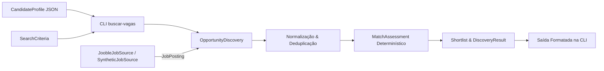

# Buscador de Vagas de Tecnologia no Brasil

Aplicação *local-first* em Python para descoberta, normalização, compatibilidade determinística (*MatchAssessment*) e ordenação (*Shortlist*) de vagas de tecnologia no Brasil.

O primeiro marco conecta a integração com a REST API oficial do **Jooble Brasil** a um motor de decisão auditável, transparente e sem dependências de Inteligência Artificial para gerar o resultado correto.

---

## Sumário

- [Objetivo e Problema Resolvido](#objetivo-e-problema-resolvido)
- [Funcionalidades Principais](#funcionalidades-principais)
- [Arquitetura](#arquitetura)
- [Requisitos](#requisitos)
- [Instalação](#instalação)
- [Configuração da JOOBLE_API_KEY](#configuração-da-jooble_api_key)
- [Exemplo de CandidateProfile](#exemplo-de-candidateprofile)
- [Uso da CLI](#uso-da-cli)
- [Interpretação de Score e Elegibilidade](#interpretação-de-score-e-elegibilidade)
- [Smoke Test Manual do Jooble Brasil](#smoke-test-manual-do-jooble-brasil)
- [Limitações](#limitações)
- [Privacidade e Segurança](#privacidade-e-segurança)
- [Roadmap](#roadmap)
- [Fonte Jooble Brasil & Inspiração](#fonte-jooble-brasil--inspiração)
- [Licença](#licença)

---

## Objetivo e Problema Resolvido

Quem busca vagas de tecnologia no Brasil encontra publicações espalhadas em diferentes portais, com títulos inconsistentes, campos ausentes e descrições pouco padronizadas. Comparar oportunidades manualmente consome tempo e dificulta distinguir:
- **Compatibilidade comprovada** de dados ausentes;
- **Requisitos impeditivos reais** de listas aspiracionais de competências preferenciais.

Esta aplicação resolve o problema ao:
1. Carregar um perfil privado local (`CandidateProfile`) mantido pelo próprio usuário;
2. Consultar fontes autorizadas de vagas (como o Jooble Brasil);
3. Normalizar títulos e consolidar publicações repetidas em oportunidades lógicas (`Opportunity`);
4. Produzir avaliações determinísticas (`MatchAssessment`) com pontuação explicável (`FitScore`) e conclusão de elegibilidade (`EligibilityStatus`);
5. Apresentar uma seleção final ordenada (`Shortlist`) mantendo a transparência de pontos fortes, lacunas e possíveis impeditivos.

---

## Funcionalidades Principais

- **Normalização Semântica de Categorias:** Mapeamento de títulos e sinônimos em português e inglês para categorias profissionais (`software-development`, `it-support-infrastructure`, `systems`, `quality-assurance`, `data`).
- **Deduplicação Conservadora:** Consolidação de publicações idênticas da mesma fonte por identificadores canônicos ou equivalência inequívoca de empresa, título e localização.
- **MatchAssessment Determinístico:** Avaliação multidimensional baseada em evidências explícitas no perfil (`supports` / `contradicts`) e no anúncio.
- **Separação entre FitScore e Elegibilidade:**
  - `FitScore` (0 a 100): score numérico agregado por 4 dimensões (Categoria, Competências, Senioridade/Programa de Entrada, Localização/Modalidade).
  - `EligibilityStatus`: conclusão separada (`eligible`, `uncertain`, `ineligible`) baseada apenas em requisitos realmente impeditivos.
- **Transparência de Desconhecidos:** Campos ausentes no anúncio não somam pontos, mas também não viram deficiências falsas.
- **CLI Amigável e Auditável:** Apresentação rica no terminal com título, empresa, localização, URL original, score, breakdown por dimensão, pontos fortes (*strengths*), lacunas (*skill gaps*), requisitos não informados (*unknown*) e possíveis impeditivos (*possible blockers*).

---

## Arquitetura

O projeto é um **Modular Monolith local-first em Python** guiado pelos seguintes princípios:
- **Interface Profunda de Descoberta:** O módulo de descoberta expõe a operação `OpportunityDiscovery.discover(profile, criteria)`, ocultando normalização, deduplicação, matching, elegibilidade e ranking.
- **Seam de Fonte Externa (`JobSource`):** Abstração que permite integrar portais externos (como `JoobleJobSource`) ou fontes sintéticas de teste sem acoplar o domínio a detalhes HTTP ou esquemas de fornecedores.
- **Execução Offline e Testabilidade:** Suíte de testes 100% offline via `pytest`, `Ruff` e `mypy` estrito.



---

## Requisitos

- **Python 3.12** ou superior (compatível e testado até Python 3.14).
- Conexão à internet apenas para consultas live ao Jooble (testes e CI funcionam completamente offline).

---

## Instalação

1. Clone o repositório:
   ```bash
   git clone https://github.com/Caslu-rj/buscador-de-vaga.git
   cd buscador-de-vaga
   ```

2. Crie e ative um ambiente virtual:
   ```bash
   python -m venv .venv

   # No Linux/macOS:
   source .venv/bin/activate

   # No Windows (PowerShell):
   .venv\Scripts\Activate.ps1
   ```

3. Instale o pacote em modo editável com as dependências de desenvolvimento:
   ```bash
   pip install -e .[dev]
   ```

---

## Configuração da JOOBLE_API_KEY

Para realizar buscas reais no Jooble Brasil, é necessário obter uma chave de API gratuita no portal de parceiros do Jooble.

A chave deve ser configurada **exclusivamente via variável de ambiente**:

### Linux / macOS:
```bash
export JOOBLE_API_KEY="sua_chave_aqui"
```

### Windows (PowerShell):
```powershell
$env:JOOBLE_API_KEY="sua_chave_aqui"
```

> **Aviso de Segurança:** Nunca versione a sua `JOOBLE_API_KEY` ou a insira em arquivos do repositório. O `.gitignore` já está pré-configurado para ignorar arquivos `.env`.

---

## Exemplo de CandidateProfile

O perfil do candidato é mantido em um arquivo JSON local. Um exemplo pode ser visto em `examples/candidate-profile.example.json`:

```json
{
  "schema_version": 1,
  "id": "candidate-exemplo",
  "target_categories": [
    "software-development",
    "quality-assurance"
  ]
}
```

Crie o seu perfil local em um diretório não versionado (por exemplo, `meu-perfil.json`).

---

## Uso da CLI

O comando `buscar-vagas` fica disponível no terminal após a instalação.

### 1. Teste offline com dados sintéticos (Tracer Bullet)

Para testar o fluxo completo sem gastar quota da API do Jooble, utilize um arquivo de postings sintéticos (veja o exemplo em `examples/job-postings.example.json`):

```bash
buscar-vagas --profile examples/candidate-profile.example.json --category software-development --location "Brasil" --postings-file examples/job-postings.example.json
```

### 2. Busca live no Jooble Brasil

Para realizar uma consulta real ao Jooble Brasil (requer `JOOBLE_API_KEY` configurada):

```bash
buscar-vagas --profile meu-perfil.json --category software-development --location "Rio de Janeiro, RJ" --jooble --limit 10
```

---

## Interpretação de Score e Elegibilidade

A aplicação separa o valor numérico de compatibilidade da decisão de elegibilidade.

### FitScore (0 a 100)
Calculado a partir de 4 dimensões de avaliação:
- **job-category (40 pts):** Alinhamento da vaga com as categorias declaradas no perfil do candidato.
- **skills (25 pts):** Competências exigidas pela vaga e comprovadas por evidências no perfil.
- **entry-program-seniority (20 pts):** Compatibilidade de nível (estágio, trainee, júnior, pleno, sênior).
- **location-workplace-mode (15 pts):** Modalidade (remota, híbrida, presencial) e localização.

> **Importante:** Requisitos não informados (`unknown`) contribuem com 0 pontos no score, mas **não** penalizam o candidato como um gap. A porcentagem de *cobertura de evidência* indica o quanto da política pôde ser avaliado com os dados disponíveis.

### EligibilityStatus
- **Elegível (`eligible`):** NENHUM requisito impeditivo (*blocking*) foi contradito por evidências do candidato.
- **Incerto (`uncertain`):** Existem possíveis impeditivos (*possible blockers*) ou dados insuficientes no anúncio para descartar a vaga. A vaga continua visível na Shortlist com o alerta explícito.
- **Inelegível (`ineligible`):** Pelo menos um requisito impeditivo foi comprovadamente contradito por evidência do perfil. A vaga é mantida no resultado auditável (`DiscoveryResult`), mas é excluída da Shortlist final.

---

## Smoke Test Manual do Jooble Brasil

Para validar a integração real com a API do Jooble sem comprometer a quota de requisições ou a execução de testes automatizados, siga as orientações abaixo:

1. **Configuração Exclusiva por Variável de Ambiente:**
   Certifique-se de definir `JOOBLE_API_KEY` no ambiente do terminal. Nunca salve a chave em arquivos versionados.
2. **Execução Delimitada:**
   Execute a CLI com um limite baixo de vagas e apenas uma página (comportamento padrão):
   ```bash
   buscar-vagas --profile examples/candidate-profile.example.json --category software-development --location "Brasil" --jooble --limit 3
   ```
3. **Regras Obrigatórias:**
   - **NUNCA** execute o smoke test live de forma automatizada no CI ou no pytest.
   - **NUNCA** registre a chave de API em logs ou repositórios.
   - **NUNCA** versione o payload retornado na chamada live.

---

## Limitações

- **Primeiro Marco:** Suporte a 1 fonte por execução (Jooble Brasil).
- **Escopo Restrito:** Consulta limitada a 1 página por execução para proteger a quota da API.
- **Deduplicação Conservadora:** Consolida apenas vagas com correspondência exata de identificadores ou tripla empresa/título/localização inequívoca.
- **Sem IA no Core:** Não utiliza LLMs para extração flexível ou preenchimento arbitrário de lacunas.

---

## Privacidade e Segurança

- **Local-first:** Seu `CandidateProfile` reside em seu computador e nunca é enviado para servidores de terceiros (apenas os termos de busca da vaga são enviados à API do Jooble).
- **Proteção de Dados Pessoais:** Arquivos `.env` e perfis de candidatos reais são ignorados pelo `.gitignore`.
- **Sanitização de Logins e Payloads:** Mensagens de erro ocultam chaves de API e corpos brutos de respostas HTTP.
- **Independência de Agentes:** O código de runtime da aplicação não possui dependência de arquivos de configuração de IA/agentes (`.agents/`, `AGENTS.md`, etc.).

---

## Roadmap

- [x] **Marco 1:** Integração com Jooble Brasil, normalização, deduplicação, MatchAssessment determinístico e Shortlist via CLI.
- [ ] **Marco 2:** Persistência local-first em SQLite e histórico de execuções (*SearchRuns*).
- [ ] **Marco 3:** Suporte a múltiplos JobSources simultâneos (ex: restauração de novas fontes abertas).
- [ ] **Marco 4:** Enriquecimento opcional e assistido por LLM sem perder o core determinístico.

---

## Fonte Jooble Brasil & Inspiração

- **Fonte Oficial:** A busca de vagas é integrada com a [API do Jooble Brasil](https://br.jooble.org/api/about).
- **Inspiração:** A arquitetura de descoberta e avaliação foi inspirada no projeto de referência [`MadsLorentzen/ai-job-search`](https://github.com/MadsLorentzen/ai-job-search).

---

## Licença

Este projeto é distribuído sob os termos da [Licença MIT](LICENSE).
