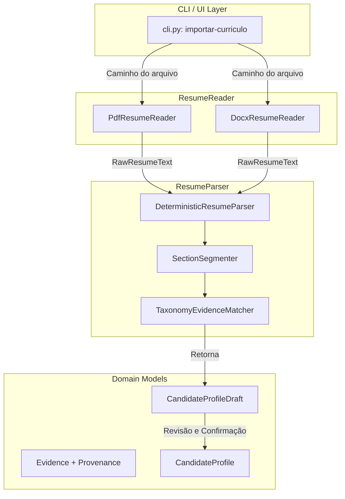

# Arquitetura de Importação e Análise de Currículo (Marco 2)

## Direção

O Marco 2 introduz a capacidade de importar e analisar currículos nos formatos PDF (`.pdf`) e DOCX (`.docx`) para gerar um `CandidateProfileDraft` auditável, com evidências e proveniências extraídas local e deterministicamente.

Em conformidade com os princípios da aplicação (*local-first*, *privacy-by-design*, *deep modules* e *deterministismo*):
1. A extração é **100% offline**, sem chamadas de rede ou uso de LLMs na nuvem.
2. A leitura física do arquivo é desacoplada da interpretação semântica das evidências.
3. O candidato revisa o rascunho (`CandidateProfileDraft`) antes de atualizá-lo para o `CandidateProfile` oficial.

---

## Módulos e Seams



---

## Interfaces dos Componentes

### 1. `ResumeReader` (Seam de Leitura Técnica)

Contrato para leitura de arquivos físicos de currículo:

```python
class ResumeReader(Protocol):
    def read(self, file_path: Path) -> RawResumeText:
        ...
```

- **`PdfResumeReader`**: Utiliza `pypdf.PdfReader` para extrair o texto de todas as páginas.
  - *Verificação de OCR:* Se a contagem total de caracteres extraídos for inferior a um limite mínimo (ex: < 30 caracteres para um documento não vazio), lança `UnreadablePdfError("PDF sem camada de texto detectável. OCR ainda não é suportado.")`.
- **`DocxResumeReader`**: Utiliza `python-docx` (`docx.Document`) para percorrer parágrafos e tabelas, extraindo o texto de forma estruturada.
- **Validação de formato:** Arquivos com extensões não suportadas lançam `UnsupportedFileFormatError`.

### 2. `ResumeParser` (Seam de Interpretação e Extração)

Contrato para análise determinística de texto:

```python
class ResumeParser(Protocol):
    def parse(self, raw_text: RawResumeText) -> CandidateProfileDraft:
        ...
```

- **`DeterministicResumeParser`**:
  1. **Segmentação:** Identifica limites de seções (`Experiência`, `Formação`, `Habilidades`, `Idiomas`, etc.) via expressões regulares robustas em PT/EN.
  2. **Extração Baseada em Taxonomia:** Percorre as seções utilizando os dicionários taxonômicos do domínio (`JobCategory`, `Skill`, `EntryProgram`, `Seniority`, `WorkplaceMode`, `Idiomas`).
  3. **Construção de `Evidence`:** Para cada item identificado, constrói um objeto `Evidence` anotado com `Provenance(origin="resume:nome_do_arquivo", locator="section:habilidades#line:2")`.

---

## Modelo de Dados do Rascunho (`CandidateProfileDraft`)

```python
@dataclass(frozen=True)
class DraftEvidence:
    evidence: Evidence
    confidence: str  # "high", "medium", "low"
    suggested_field: str  # "skills", "target_categories", "entry_program", etc.

@dataclass(frozen=True)
class CandidateProfileDraft:
    source_file: str
    raw_text_summary: str
    suggested_evidences: tuple[DraftEvidence, ...]
    unrecognized_sections: tuple[str, ...]
```

---

## Trata de Erros e Exceções Tipadas

| Exceção | Causa | Mensagem / Ação |
| :--- | :--- | :--- |
| `UnreadablePdfError` | PDF é uma imagem escaneada (sem camada de texto extraível). | "O arquivo PDF fornecido não possui camada de texto selecionável. O recurso de OCR não está disponível no Marco 2." |
| `UnsupportedFileFormatError` | Extensão de arquivo diferente de `.pdf` ou `.docx`. | "Formato de arquivo não suportado. Por favor, utilize arquivos .pdf ou .docx." |
| `EmptyDocumentError` | O arquivo está vazio (0 bytes). | "O arquivo fornecido está vazio." |
| `ResumeReadError` | Arquivo corrompido ou inacessível. | "Não foi possível ler o arquivo de currículo especificador." |

---

## Estrutura de Arquivos Proposta para o Marco 2

```text
src/buscador_de_vaga/
├── resume/
│   ├── __init__.py
│   ├── reader.py       # ResumeReader, PdfResumeReader, DocxResumeReader
│   ├── parser.py       # ResumeParser, DeterministicResumeParser
│   ├── exceptions.py   # UnreadablePdfError, etc.
│   └── models.py       # CandidateProfileDraft, DraftEvidence
```

---

## Seams de Teste e Estratégia de Qualidade

1. **Testes Unitários de Leitura (`test_resume_reader.py`):**
   - Leitura de PDF válido com camada de texto (usando fixture sintética em bytes/arquivo temporário).
   - Detecção e exceção `UnreadablePdfError` para PDF sem texto (PDF com imagem/vazio).
   - Leitura de DOCX válido com parágrafos e tabelas.
   - Rejeição de formatos inválidos (`.txt`, `.jpg`).
2. **Testes Unitários do Parser (`test_resume_parser.py`):**
   - Extração de skills, cargos passados, nível de senioridade, idiomas e formação.
   - Geração correta de `Provenance` para cada `Evidence`.
   - Classificação de seções reconhecidas vs não reconhecidas.
3. **Testes de Integração da CLI (`test_cli_resume.py`):**
   - Comando `importar-curriculo --file curriculo.pdf --review` exibe o rascunho formatado.
   - Salvamento e consolidação do rascunho em `candidate-profile.json`.
