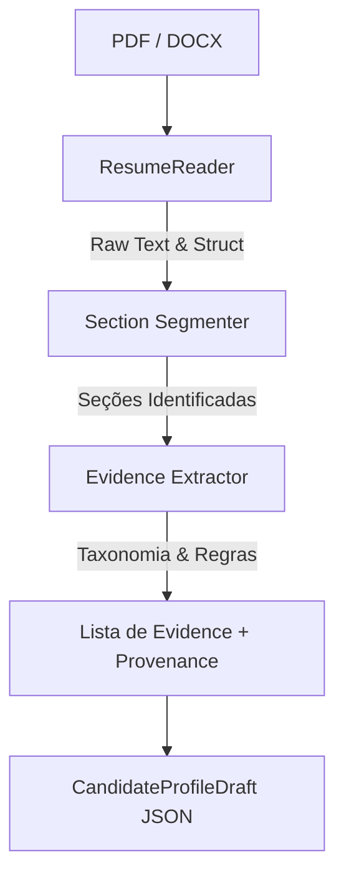

# Avaliação de Bibliotecas e Estratégia de Parsing de Currículos (PDF/DOCX)

## 1. Contexto e Objetivos

O Marco 2 do `buscador-de-vaga` visa permitir a importação de currículos em formato PDF e DOCX para gerar automaticamente um `CandidateProfileDraft` contendo evidências (`Evidence`) com proveniência (`Provenance`), prontas para revisão humana e uso no `MatchAssessment`.

Diretrizes inegociáveis:
- **100% Local-first e Offline:** NENHUM dado do currículo pode ser enviado para APIs externas ou serviços de IA de terceiros.
- **Core Determinístico:** A extração não pode depender obrigatoriamente de LLM.
- **Footprint Leve:** Bibliotecas pequenas, maduras e sem dependências binárias complexas.
- **Detecção de OCR Ausente:** PDFs escaneados ou sem camada de texto devem gerar erro acionável informando a falta de suporte a OCR neste marco.

---

## 2. Comparativo de Bibliotecas Python

### 2.1 Extração de Texto em PDF

| Biblioteca | Licença | Tamanho / Deps | Tipo | Prós | Contras | Decisão |
| :--- | :--- | :--- | :--- | :--- | :--- | :--- |
| **`pypdf`** | BSD-3-Clause | ~2 MB / Zero deps | Pure Python | Madura, leve, pura em Python, extração rápida de texto de páginas, sem binários C. | Extração básica de layout, sem reflow avançado. | **SELECIONADA** |
| `pdfplumber` | MIT | ~15 MB / Várias deps | Python + `pdfminer` | Excelente preservação de tabelas e coordenadas. | Mais pesada, dependência do `pdfminer.six`. | Descartada por footprint. |
| `PyMuPDF` (`fitz`) | AGPL / Comercial | ~30 MB / C++ wheels | Binding C | Muito rápida. | Licença AGPL incompatível com MIT e binários C pesados. | Descartada por licença/tamanho. |
| `pdfminer.six` | MIT | ~10 MB | Pure Python | Análise detalhada do AST do PDF. | API verbosa e lenta para leitura simples. | Descartada por complexidade. |

**Conclusão para PDF:** `pypdf` (`pypdf>=5.0.0,<6`) é a escolha ideal. É leve, desenvolvida em Python puro, mantida ativamente e permite extrair páginas com `page.extract_text()`. Se `extract_text()` retornar texto vazio ou com contagem insignificante de caracteres em um PDF de várias páginas, sinaliza-se `UnreadablePdfError` ("PDF sem camada de texto detectável. OCR ainda não é suportado.").

### 2.2 Extração de Texto em DOCX

| Biblioteca | Licença | Tamanho / Deps | Tipo | Prós | Contras | Decisão |
| :--- | :--- | :--- | :--- | :--- | :--- | :--- |
| **`python-docx`** | MIT | ~1 MB / `lxml` | Pure Python | Padrão da indústria, lê parágrafos, tabelas, cabeçalhos de forma estruturada. | Requer arquivos no formato OpenXML (`.docx`). | **SELECIONADA** |
| `docx2txt` | MIT | <1 MB | Pure Python | Simples. | Não mantida ativamente, sem suporte a tabelas estruturadas. | Descartada. |

**Conclusão para DOCX:** `python-docx` (`python-docx>=1.1.0,<2`) é a biblioteca padrão e ideal.

---

## 3. Estratégia de Parsing Determinístico

A abordagem determinística decompõe o texto do currículo em duas fases:



### 3.1 Segmentação por Seções

O parser identifica seções comuns utilizando expressões regulares em português e inglês:
- **Experiência Profissional:** `Experiência`, `Histórico Profissional`, `Experience`, `Work History`
- **Formação Acadêmica:** `Formação`, `Educação`, `Education`, `Academic Background`
- **Habilidades & Tecnologias:** `Habilidades`, `Competências`, `Skills`, `Tecnologias`, `Conhecimentos`
- **Cursos & Certificações:** `Cursos`, `Certificações`, `Certificates`, `Courses`
- **Idiomas:** `Idiomas`, `Languages`
- **Projetos:** `Projetos`, `Projects`
- **Localização / Contato:** `Localização`, `Endereço`, `Cidade`, `Location`

### 3.2 Extração com Base na Taxonomia do Domínio

Reutiliza e expande o dicionário taxonômico já estabelecido no Marco 1 (`_CATEGORY_TITLE_ALIASES`, `_SKILL_ALIASES`, `_ENTRY_PROGRAM_ALIASES`, `_SENIORITY_ALIASES`, `_WORKPLACE_MODE_ALIASES`):
1. **JobCategories:** Reconhecimento de títulos de cargos passados para sugerir `target_categories`.
2. **Skills / Tecnologias:** Busca por palavras-chave de linguagens, frameworks, bancos de dados, cloud e ferramentas (ex: `Python`, `Java`, `React`, `Docker`, `AWS`, `SQL`, `Git`, `Linux`).
3. **Entry Program & Seniority:** Detecção de palavras como `Estágio`, `Júnior`, `Pleno`, `Sênior`.
4. **Idiomas:** Detecção de `Português`, `Inglês`, `Espanhol` e seus níveis.

### 3.3 Geração de Provenance

Cada `Evidence` extraída possui rastreabilidade exata:
```python
Provenance(
    origin="resume:curriculo.pdf",
    locator="section:skills#line:3"
)
```

---

## 4. Garantias de Privacidade e Segurança

1. **Isolamento de Dados Pessoais:** O conteúdo bruto do currículo (nome, telefone, CPF, endereço) **nunca** é enviado ao Jooble ou mantido em logs da aplicação.
2. **Consultas ao Jooble:** O `OpportunityDiscovery` continua enviando apenas `JobSourceQuery` derivada dos critérios de busca (`keywords`, `location`, `limit`).
3. **Versionamento:** O `.gitignore` foi atualizado para bloquear arquivos `.pdf`, `.docx` e diretórios `/resumes/`. As fixtures de teste serão 100% fictícias.
